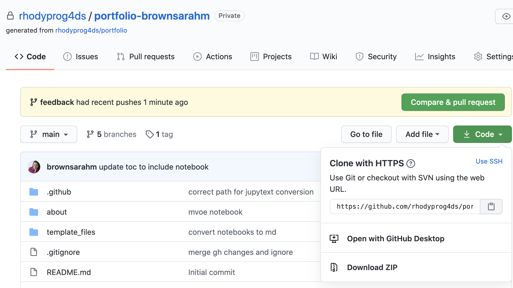
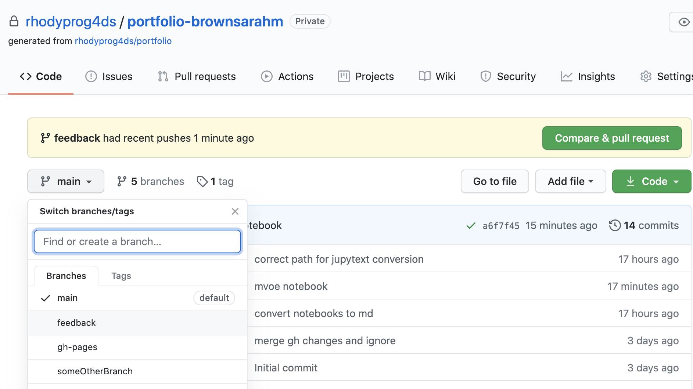
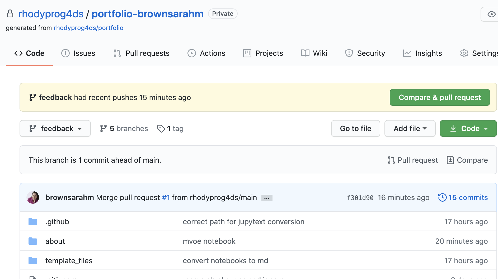
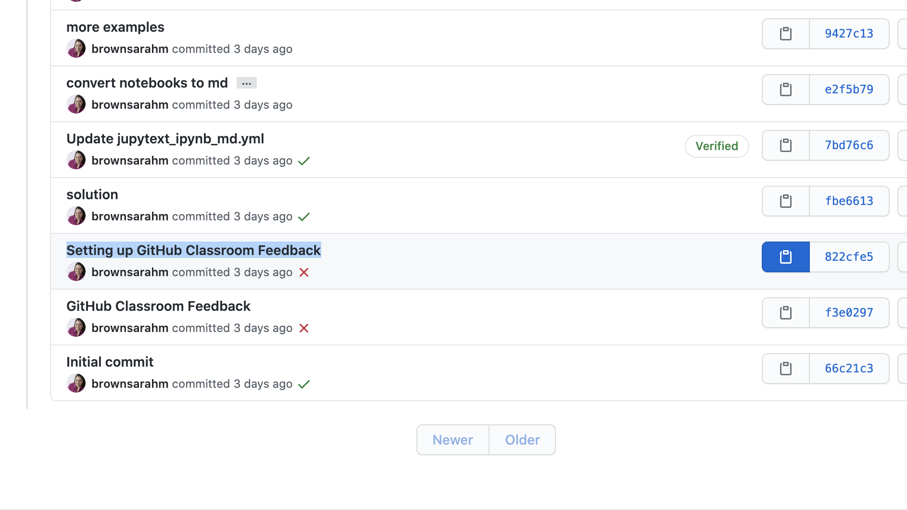
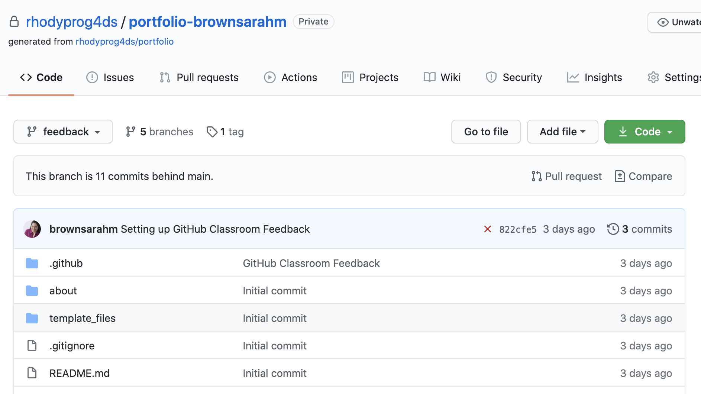
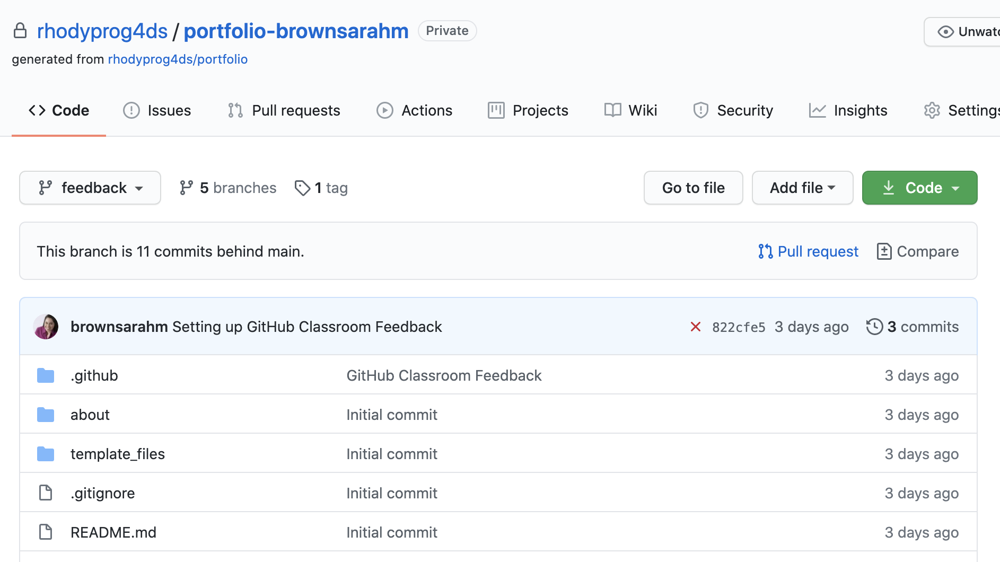
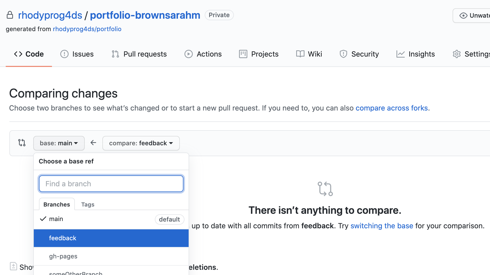
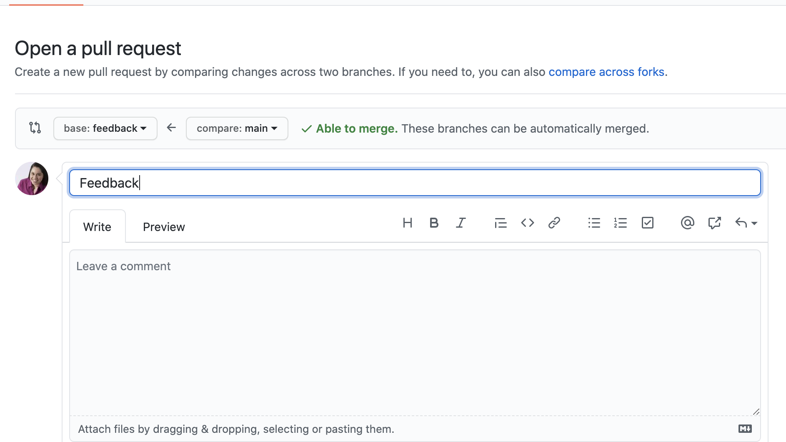

# Git and GitHub


<!--
````{toggle}

````
 -->
## I can't push to my repository, I get an error that updates were rejected
````{toggle}
If your error looks like this...
```
! [rejected] main -> main (fetch first)
error: failed to push some refs to <repository name>
hint: Updates were rejected because the remote contains work that you do
hint: not have locally. This is usually caused by another repository pushing
hint: to the same ref. You may want to first integrate the remote changes
hint: (e.g., 'git pull ...') before pushing again.
hint: See the 'Note about fast-forwards' in 'git push --help' for details.

```

Your local version and github version are out of sync, you need to pull the changes from github to your local computer before you can push new changes there.  

After you run
```
git pull
```

You'll probably have to [resolve a merge conflict](https://docs.github.com/en/github/collaborating-with-pull-requests/addressing-merge-conflicts/resolving-a-merge-conflict-using-the-command-line)
````


## My command line says I cannot use a password
````{toggle}
GitHub has [strong rules](https://docs.github.com/en/github/authenticating-to-github/keeping-your-account-and-data-secure/about-authentication-to-github) about authentication
You need to use SSH with a public/private key; HTTPS with a [Personal Access Token](https://docs.github.com/en/github/authenticating-to-github/keeping-your-account-and-data-secure/creating-a-personal-access-token) or use the [GitHub CLI](https://cli.github.com/) [auth](https://cli.github.com/manual/gh_auth_login)

````

<!-- ### My .ipynb file isn't showing in the staging area or didn't push
````{toggle}
.ipynb files are json that include all of the output, including tables as html and plots as svg, so, unlike plain code files, they don't play well with
version control.  

Your portfolio has `*/*.ipynb` in the `.gitignore` file, so that these files do
not end up in your repository.  Instead, you'll convert your notebooks to
[Myst Markdown](https://myst-parser.readthedocs.io/en/latest/) with
[jupytext](https://jupytext.readthedocs.io/) via a
[precommit hook](https://jupytext.readthedocs.io/en/latest/using-pre-commit.html).

Your portfolio has the code to do this already, what you should do is make sure
that `pre-commit` is installed and then run `pre-commit install`  
(see your portfolio's README.md file for more detail)

If this doesn't work, you can follow the alterntive in the porfolio readme.

If that doesn't work, and you have time before the deadline, create an issue to
get help.  

As a last resort, use the jupyter interface to download (File > Download as > ...)your notebook as `.md`
if avialable or `.py` if not and then move that file from your Downloads folder
to your repository.  We'll set up another workflow for future work
```` -->


<!-- ### My copy of the site won't compile
````{toggle}
If there's an error your notebook it can't complete running. You can allow it to run if the error is on purpose by changing settings as mentioned on the [formatting](portfolio/formatting) page.

```` -->


(preemptive-merge)=
## Help! I accidentally merged the Feedback Pull Request before my assignment was graded
````{toggle}

That's ok. You can fix it.

You'll have to work offline and use GitHub in your browser together for this fix. The following instuctions will work in terminal on Mac or Linux or in GitBash for Windows. (see [Programming Environment section on the tools page](programming-env)).

First get the url to clone your repository (unless you already have it cloned then skip ahead): on the main page for your repository, click the green "Code" button, then copy the url that's show


Next open a terminal or GitBash and type the following.

```
git clone
```

then past your url that you copied. It will look something like this, but the last part will be the current assignment repo and your username.

```
git clone https://github.com/rhodyprog4ds/portfolio-brownsarahm.git
```

When you merged the Feedback pull request you advanced the `feedback` branch, so we need to hard reset it back to before you did any work. To do this, first check it out, by navigating into the folder for your repository (created when you cloned above) and then checking it out, and making sure it's up to date with the `remote` (the copy on GitHub)

```
cd portfolio-brownsarahm
git checkout feedback
git pull
```

Now, you have to figure out what commit to revert to, so go back to GitHub in your browser, and swithc to the feedback branch there. Click on where it says `main` on the top right next to the branch icon and choose feedback from the list.



Now view the list of all of the commits to this branch, by clicking on the clock icon with a number of commits



On the commits page scroll down and find the commit titled "Setting up GitHub Classroom Feedback" and copy its hash, by clicking on the clipboard icon next to the short version.



Now, back on your terminal, type the following

```
git reset --hard
```

then paste the commit hash you copied, it will look something like the following, but your hash will be different.

```
git reset --hard 822cfe51a70d356d448bcaede5b15282838a5028
```

If it works, your terminal will say something like
```
HEAD is now at 822cfe5 Setting up GitHub Classroom Feedback
```

but the number on yours will be different.

Now your local copy of the `feedback` branch is reverted back as if you had not merged the pull request and what's left to do is to push those changes to GitHub. By default, GitHub won't let you push changes unless you have all of the changes that have been made on their side, so we have to tell Git to force GitHub to do this.

Since we're about to do something with forcing, we should first check that we're doing the right thing.

```
git status
```

and it should show something like

```
On branch feedback
Your branch is behind 'origin/feedback' by 12 commits, and can be fast-forwarded.
  (use "git pull" to update your local branch)
```

Your number of commits will probably be different but the important things to see here is that it says `On branch feedback` so that you know you're not deleting the `main` copy of your work and `Your branch is behind origin/feedback` to know that reverting worked.

Now to make GitHub match your reverted local copy.

```
git push origin -f
```

and you'll get something like this to know that it worked

```
Total 0 (delta 0), reused 0 (delta 0)
To https://github.com/rhodyprog4ds/portfolio-brownsarahm.git
 + f301d90...822cfe5 feedback -> feedback (forced update)
```

Again, the numbers will be different and it will be your url, not mine.

Now back on GitHub, in your browser, click on the code tab. It should look something like this now. Notice that it says, "This branch is 11 commits behind main" your number will be different but it should be 1 less than the number you had when you checked `git status`. This is because we reverted the changes you made to main (11 for me) and the 1 commit for merging main into feedback. Also the last commit (at the top, should say "Setting up GitHub Classroom Feedback").



Now, you need to recreate your Pull Request, click where it says pull request.



It will say there isn't anything to compare, but this is because it's trying to use `feedback` to update `main`. We want to use `main` to update `feedback` for this PR. So we have to swap them. Change base from `main` to `feedback` by clicking on it and choosing `feedback` from the list.



Then the change the compare `feedback` on the right to `main`. Once you do that the page will change to the "Open a Pull Request" interface.



Make the title "Feedback" put a note in the body and then click the green "Create Pull Request" button.

Now you're done!

If you have trouble, create an issue and tag `@@rhodyprog4ds/fall20instructors` for help.

````
## For an Assignment, should we make a new branch for every assignment or do everything in one branch?
````
Doing each new assignment in its own branch is best practice. In a typical software development flow once the codebase is stable a new branch would be created for each new feature or patch. This analogy should help you build intuition for this GitHub flow and using branches.  Also, pull requests are the best way for us to give you feedback. Also, if you create a branch when you do not need it, you can easily merge them after you are done, but it is hard to isolate things onto a branch if it's on main already.
````

## How would I continue to add to this FAQ page by myself?
````{toggle}
Getting everything set up is really simple! Though it gets a little bit technical. This will describe the process to fork any remote repo and allow you to use ```git fetch``` to get information from the remote repo you created the fork from and ```git push``` to your fork (which can then be merged by the original owner you forked from).

This is useful for suggesting changes to a repository that you do not own or have access to at all, with the original owner still being able to accept or deny the changes.

On the GitHub repository you wish to fork, click the "Fork" icon at the top of the page. You can then rename the repo, only copy the main branch etc., however we just want to continue.

It then brings you to the new remote repository that is now under your name.

Clone the repo using ```git clone <clone-link>``` in your directory of choosing.

> NOTE: This repo is not connected to the original remote repo that you forked from. It is connected to your forked repo you just created.

You can use the below command 
```
git remote -v
```
where you will get (most times) the following back:

> origin <https://github.com/<username>/<repo-name>.git> (fetch)
> origin <https://github.com/<username>/<repo-name>.git> (push)

Your local repository does not have the ability to pull or fetch from the original repository, only the fork you have created. You can fix this easily though.

Using the command
```
git remote add upstream <original-repo-clone-link>
```
adds the original repository as a remote ref that you can use in other commands, for example ```git fetch``` or ```git pull```

> NOTE: "upstream" in the above command can be replaced with whatever you want, just note that you will use that name when using other commands referencing it.

When using ```git remote -v``` again, you now get the following back:

> origin <https://github.com/<username>/<repo-name>.git> (fetch)
> origin <https://github.com/<username>/<repo-name>.git> (push)
> upstream <https://github.com/<original-owners-username>/<repo-name>.git> (fetch)
> upstream <https://github.com/<original-owners-username>/<repo-name>.git> (push)

You can now run the command 
```
git fetch upstream
```
to successfully fetch all information from the original remote repo.

Running 
```
git merge upstream/main
```
then merges the fetched information from the remote repo into your local forked repo.

When pushing your changes, you will continue to either use
```
git push
```
or
```
git push origin
```
of course after pushing upstream for the first time. 

Remember, you are not pushing to the original repo, you are pushing to your fork.  You can only pull and fetch from the original remote repo.

I hope this helps!
````